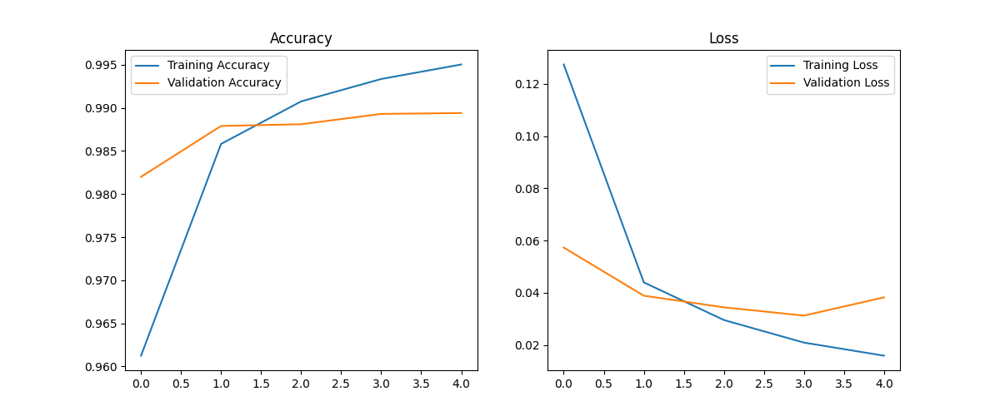

# MNIST Handwritten Digit Recognizer (CNN)

A Convolutional Neural Network trained on the MNIST dataset (handwritten digits 0–9).  
Achieved ~99% test accuracy.

## Overview
- **Dataset:** MNIST (60,000 train / 10,000 test images)
- **Framework:** TensorFlow / Keras
- **Model:** Convolutional Neural Network (Conv2D → ReLU → MaxPool → Dense)
- **Outputs:**
  - `mnist_cnn.h5` → trained model (ignored in repo, must be trained locally)
  - `docs/training_curves.png` → accuracy & loss visualization

## Training Curves
Below are the training and validation accuracy & loss curves produced during training:



## Setup & Usage

1. Clone the repository:
   ```bash
   git clone https://github.com/kirpiim/mnist-cnn-pytorch.git
   cd mnist-cnn-pytorch
