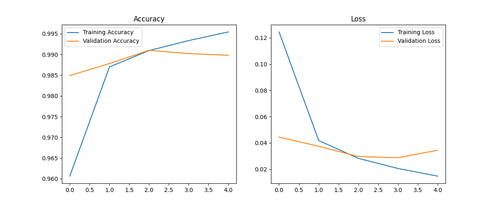

# MNIST Handwritten Digit Recognizer (CNN)

A Convolutional Neural Network trained on the MNIST dataset (handwritten digits 0–9).  
Achieved ~99% test accuracy.

## Overview
- Dataset: MNIST (60k train / 10k test)
- Framework: TensorFlow / Keras
- Model: Simple CNN (Conv2D, ReLU, MaxPool, Dense)
- Output: `mnist_cnn.h5` (saved model) and `training_curves.png`

## Training Curves
Below are the training and validation accuracy & loss curves produced during training:



## Usage
Train:
```bash
python train.py
