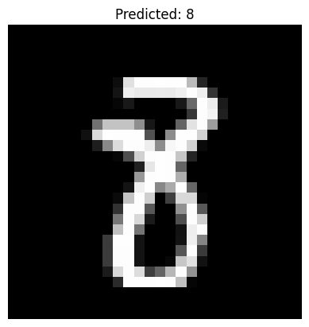

# MNIST Handwritten Digit Recognizer (CNN)

A Convolutional Neural Network trained on the MNIST dataset (handwritten digits 0–9).  
Achieved ~99% test accuracy.

## Overview
- **Dataset:** MNIST (60,000 train / 10,000 test images)
- **Framework:** TensorFlow / Keras
- **Model:** Convolutional Neural Network (Conv2D → ReLU → MaxPool → Dense)
- **Outputs:**
  - `mnist_cnn.h5` → trained model (ignored in repo, must be trained locally)
  - `docs/training_curves.png` → accuracy & loss visualization

## Technologies Used
- **Programming Language:** Python 3  
- **Framework:** TensorFlow / Keras  
- **Libraries:** NumPy, Matplotlib, Pillow  
- **Model Type:** Convolutional Neural Network (CNN)  
- **Deployment Formats:** TensorFlow Lite, ONNX  
- **Environment:** Jupyter / VS Code / CLI

## Training Curves
Below are the training and validation accuracy & loss curves produced during training:


## Setup & Usage

### 1. Clone the repository
```bash
  git clone https://github.com/kirpiim/mnist-cnn-pytorch.git
  cd mnist-cnn-pytorch
```
### 2. Install dependencies
```bash
pip install -r requirements.txt
```


### 3. Train the model
```bash
python -m src.train
```
### 4. Evaluate the model
```bash
python mnist_test.py
```
### 5. Predict a single image
```bash
python predict.py path/to/image.png
```
### 6. Export the model

# Export to TensorFlow Lite
```bash
python export_tflite.py
```
# Export to ONNX
```bash
python export_onnx.py
```

## Results
- Final test accuracy: ~99%  
- Training/validation curves saved in `docs/training_curves.png`

**Example prediction:**
Below is a sample image prediction made by the trained CNN:



Command used:
```bash
python mnist_test.py
```

# Predicted: 8

## Project Structure

```text
.
├── src/
│   ├── models/
│   │   └── cnn.py          # CNN model definition
│   ├── train.py            # Training script
│   ├── predict.py          # CLI predictor
│   ├── export_tflite.py    # Export model to TFLite
│   ├── export_onnx.py      # Export model to ONNX
├── mnist_test.py           # Evaluation script
├── requirements.txt
├── docs/
│   └── training_curves.png # Training visualization
└── README.md
```

## Extra Features
CLI Predictor: Classify digits from PNG/JPG
Deployment Ready: Export to ONNX / TensorFlow Lite for mobile & edge devices

## What I Learned
- Building and training **Convolutional Neural Networks** for image recognition  
- Using **TensorFlow/Keras** for model construction, training, and evaluation  
- Handling **data preprocessing and normalization** for grayscale image datasets  
- Plotting and analyzing **training/validation accuracy curves**  
- Exporting trained models to **TensorFlow Lite** and **ONNX** for deployment  
- Structuring a clean, **modular ML project** with reusable components  
